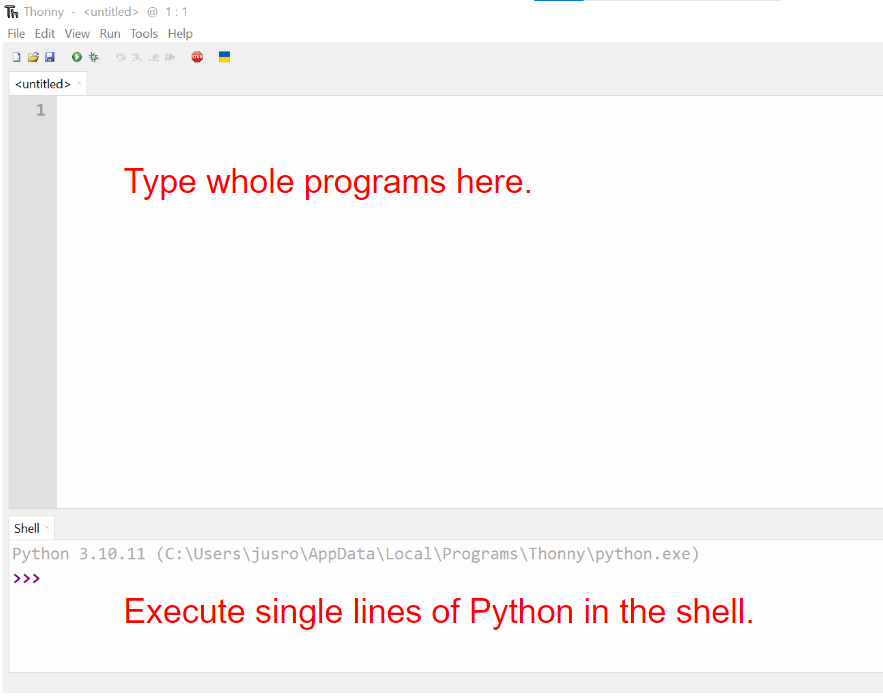

= Book Title
// Must have this immediately below Level 0
// :source-language: Python
:doctype: book
:source-highlighter: highlight.js
:icons: font
:toc: auto

link:downloads/report.pdf[Get Report]

== About this book

I often get students asking me if there is a book or a course they can do to learn more about Python and I often say no, because:

* Most books will cover lots of stuff you don't need to know for the GCSE

* The GCSE exam board (Edexcel) has weird ways of doing things that you won't find in books

So I have decided to write my own book that

* covers only what is covered by the GCSE

* tells you all the weird things that the exam board want you to do

== Conventions used in this book

There are lots of different ways of writing code, so I've had to make some decisions about how I will do things in this book. In general, I have tried to follow what the GCSE does, even when it is unusual. This section explains my decisions.

* Variable and function names follow the GCSE's practice of using what is known as **camel case**. This means a variable name for an email address will be `emailAddress`, rather than the more usual `emailaddress` or `email_address`, as would normally by used in Python. The disadvantage of the GCSE's choice of camel case is that built-in functions do not follow this convention, so there is an inconsistency. For instance, the built-in function to determine if a string is all upper case is `isalpha` rather than `isAlpha`, as the GCSE would have it.
* Constants, although not directly supported by Python, are written in all capitals, optionally delimited by underscores, e.g. FILENAME or FILE_NAME. This is the convention used by the GCSE and by Python programmers in general.
* I have avoided the use of the `break` statement, since the GCSE exam board has indicated that they consider its use to be bad programming practice, even though it most certainly isn't (indeed there are language features in Python that depend on its use). The GCSE exam board have decided that a for loop should be used when every item of a sequence is to be processed, but a while loop (with a flag variable) should be used in order to break out of a loop and so process only some of the items of a sequence. Since marks are available for what they consider "good programming practice", I have tried to ensure that the techniques in this book are most likely to attract full marks. 
* Even though the exam board explicitly state that students will not be penalised for using more advanced techniques, I have avoided them in this book. This is for two reasons:
   - Firstly, GCSE mark schemes often award marks for techniques that can be avoided by using more advanced techniques; but if you use those advanced techniques, it is not clear to me how an examiner, especially a lazy one, can award those marks. For example, Python allows you to iterate over a sequence without using an integer index, and yet I have seen mark schemes that award a mark for using one. Similarly, I have seen mark schemes that award marks for explicitly iterating over a list of integers in order to find the maximum; how can these marks be awarded for use of the built-in `max` function?
   - Secondly, I am not convinced that the average GCSE examiner is sufficiently _au fait_ with advanced techniques to be able to understand them. Examiners will be less likely to award marks for code they don't understand. 

== Getting started with Python

=== Downloading Thonny

I recommend that you use Thonny as your Python editor because it has the Python interpreter built in. It can be downloaded from https://thonny.org and it is perfectly good for GCSE and A-Level. 

=== The Thonny interface

When you open Thonny you will see two panes. 

The upper pane is a text editor that allows you to edit Python files. Write whole programs in here and press the green play button to execute. (You will need to have saved the file somewhere first.)

.The Thonny interface

The bottom pane is the shell. Here you can execute single lines of Python in an interactive REPL mode. When you write a line of code and execute it, Python will evaluate it and print the result. If the line of code doesn't evaluate to anything, nothing will be printed.

.Using the Thonny shell
image:Thonny_shell.png[Thonny interactive shell, 200]

**Thonny tips:**
* If your program hangs, use the red Stop button to halt it.

* You can clear the shell by right-clicking on it and choosing Clear.

* Thonny has an "assistant" that warns you of various things. I find it annoying. You can disable it in Tools, Options, Assistant....

* Python has a debugger built in. In my opinion, the default setting of *Nicer* is too verbose. You can change it to *Faster* in Tools, Options, Run & Debug....

== Variables and data types

=== Variables

We can store items of data for use in computer programs. These stored items are called variables. We refer to variables using names.

[source,Python]
----
# Store the value 5 in a variable called x
x = 5

# Store the value "Fred" in a variable called name
name = "Fred"
----

You give a variable a value by using the `=`, which is known as the *assignment operator*. So when we assign the value 5 to the variable x like this `x = 5`, we are really saying *let x take the value of 5*. Some languages actually use the word `let` when they do assignment, e.g. `let x = 5`, but Python doesn't.

In the statement `x = 5`, the x is an *integer variable* and the 5 is an *integer literal*. Assignment always happens right to left. You cannot write 5 = x.  

==== Variable names

Variable names can include letters, numbers and the underscore (_) character, but they cannot *begin* with numbers.

You should try to choose variable names that make it easy to tell meaning of the data held in the variable. 

===== Capitalization in variable names

There are different conventions about whether to include capital letters in variable names or not. Edexcel likes to use **camel case**, in which:

* If the variable name is just one word, then it is all lower case.

* If the variable is two or more words together, the first is lower case and the rest are title case (with the first letter capitalised).

The following variable names are in camel case:

* name
* emailAddress
* passwordIsValid

You should probably adopt this convention (even though it's not normal for Python programmers, who generally use something called snake case).

===== Naming conflicts

Some names in Python already mean something and you should therefore not use them as variable names. 

Some examples of names you should **not** use for variables are:

sum, max, min, int, float, bool, str, string, random, list, type, dir

Single-letter names are generally not a good idea but sometimes they're ok. For instance:

* i, j, k are often used as simple counter integers (integer means whole number)
* x, y, z are often used for coordinates

=== Data types

Variables stored data and data can be of different types. The GCSE focuses on the following data types:

* Whole numbers (**integers**)
* Numbers with decimal points (**floats**)
* Sequences of text characters (**strings**)
* True/False variables (**booleans**)

=== Vocabulary

**Assignment:** Giving a variable its first or a new value. In Python, initialisation and assignment are the same except the initialisation is a special term used for the *first* assignment.

**Intialisation:** Creating and giving a variable it's first value, e.g. `x = 5`

=== Exercises

1. Which of the following are valid variable names in Python?
   - EMAILADDRESS
   - emailaddress
   - email-address
   - email_address
   - emailaddress1
   - 1emailaddress
   - emailAddress

2. Which of the variable names for email address given above would you expect to see in an Edexcel GCSE paper?

3. Name the data type (integer, float, string, boolean) of each of these variables after they have been initialised:
    - `name = "Fred"`
    - `isPrefect = True`
    - `age = 15`
    - `height = 1.73`

4. Explain why `x` is not a good variable name for storing the height of a rectangle. What would be a better variable name?

== Getting input from the user

I include this section early because it quickly allows us to write interactive programs that do something useful. You can get input from the user by using the `input` function.

This program asks the user their name and then prints a "Hello " followed by whatever name they entered.

[source,Python]
----
name = input("Enter your name: ")
print("Hello " + name)
----

Note the the `input` function **always** returns a string. *Returns* is a special term used in relation to functions. It means *gives back* and I will use it a lot in the section on functions later. 

It makes sense in the example above that `name` is a string, since it is a word, a sequence of characters, but try running this program:

[source,Python]
----
n1 = input("Enter the first number: ")
n2 = input("Enter the second number: ")
print("The sum is " + str(n1 + n2))
----

.Output:
----
Enter the first number: 4
Enter the second number: 5
The sum is 45
----

This program has gone wrong because the *return type* of the `input` function is *string*, and when you use the *plus operator* (+) between two strings the strings are *concatenated*, i.e. chained together. 

We can fix this problem by *converting* the strings into integers, because when you use the plus operator (+) between two integers the integers are added.

[source,Python]
----
n1 = int(input("Enter the first number: "))
n2 = int(input("Enter the second number: "))
print("The sum is " + str(n1 + n2))
----

----
Enter the first number: 4
Enter the second number: 5
The sum is 9
----

Look carefully at the line:

[source,Python]
----
n1 = int(input("Enter the first number: "))
----

This is the order of events:

1. Make a string literal "Enter the first number: " and *pass it* to the `input` function.

2. The input function then prints "Enter the first number: " and waits for the user to type something.

3. Take the thing that the user typed and pass it to the `int` function, which turns it from a string to an integer.

4. Assign that integer to the variable n1.

Now look carefully at the line:
[source,Python]
----
print("The sum is " + str(n1 + n2))
----

Now that `n1` and `n2` are integers, we need to turn them back to strings before we can concatenate them with the string "The sum is ". We do this with the `str` function.

This is the order of events:

1. Add the values of the two integer variables n1 and n2.

2. The `str` function then turns the result from an integer to a string.

3. The string is then concatenated on the end of the string literal "The sum is " to form a longer string.

4. That longer string is then passed to the `print` function, which prints it out on the screen.

In summary:

* The `int` function is used to turn strings into integers. You will need to use it when you want to do arithmetic or comparison (e.g. <, >, etc) with the value the user entered.

* The `str` function is used to turn integers into strings. You will need to use it if you want to concatenate an integer value to a string value before printing.

**Exercises:**

1. Write a program that asks the user to enter their age and then prints "You are N years old", where N is the age they entered.

2. Write a program that asks the user to enter their age and then prints "You are N+10 years old", where N+10 is their age plus 10 years. 

3. Explain why you need to use the `int` function in task 2 but not in task 1. 

== More about strings

=== Lexicographical comparison of strings (alphabetical order)

You can compare strings using the `>` and `<` operators. This will compare them lexicographically, which means that if stringA would come before stringB in a dictionary, then stringA is considered to be "less than" stringB.

WARNING: When comparing strings lexicographically, bear in mind that all upper case letters are considered "less than" all lower case letters. This is because upper case letters appear before lower case letters in the ASCII table.

Look at this example program, which asks the user to enter two words and tells them which is "less than" which.

[source,Python]
----
word1 = input("Enter first word: ")
word2 = input("Enter second word: ")
if word1 == word2:
    print("Words are the same!")
elif word1 < word2:
    print(word1 + " is less than " + word2)
else:
    print(word2 + " is less than " + word1)
----

.Output
----
Enter first word: wombat
Enter second word: newt
newt is less than wombat

Enter first word: Zebra
Enter second word: aardvark
Zebra is less than aardvark
----

IMPORTANT: You need to know that you can compare strings with `>` and `<` for the GCSE. Remember it, because programming this behaviour yourself will take many lines of complicated code.

=== String functions

You have seen some functions that are built-in to Python, e.g. len, int, input, print. We refer to these as **built-in functions**. There are also functions just for strings. We refer to these as **string functions**. 

This program asks the user for their name and then prints it in capital (upper case) letters:

[source,Python]
----
name = input("Enter your name: ")
print(name.upper())
----

You can call (execute, run) string functions by using dot notation: adding a dot after the string, followed by the name of the function, followed by ().

[IMPORTANT]
.Use brackets when you want to call functions
====
With any function, you must put () after its name if you want to **call** it. Try just printing `name.upper` and you will get an odd result because Python will try to print the function itself and not the result of calling it. 

[source,Python]
----
name = input("Enter your name: ")
print(name.upper) # left out the brackets!
----

.Output
----
<built-in method upper of str object at 0x000002B1FE6E5E30>
----
====

=== String functions in the GCSE

The GCSE expects you to be familiar with the following string functions  (<str> just means any string variable or literal):

[cols="1,1"]
|===
| Function | Description

| <str>.lower
| Returns <str> as all lower case

| <str>.upper
| Returns <str> as all upper case
|===

=== Strings as sequences

There are two **sequence types** that you need to be familiar with for the GCSE: **strings** and **lists**. Sequence types allow you to:

* Get individual items of the sequence using an **index**.

* **Iterate** through every item in the sequence using a **for loop**.

* Use the keyword **in** to check if an item is in the sequence (although the GCSE doesn't seem to use this much).

==== Example of string indexing
Consider this program, which asks the user for their name and tells them the 4th character:
[source,Python]
----
name = input("Enter your name: ")
print("The 4th character of your name is " + name[3])
----

**Notes:**

* We put `name[3]` for the 4th character because counting starts at zero.

* If the name is less then 4 characters we will get an `IndexError`, meaning we've tried to access an item of a sequence that isn't there.

==== Example of iterating through a string using a for loop

Consider this program, which counts the number of "a"s in the string "Aardvark", but iterating through the string.

[source,Python]
----
count = 0
s = "Aardvark"
for ch in s:
	if ch == "a":
		count = count + 1
print("There are " + str(count) + " a's in " + s)
----

**Notes:**

* It's ok to use a single-letter variable name like `s` in this example, because my variable is just a throw-away value.

* We have to use the `str` function to convert the integer `count` to a string before we can concatenate it with the rest of the message string, but we don't need to do that with `s` because `s` is already a string.

* This example prints 2, because Python is case-sensitive; "a" is different from "A".

==== Example of using `in` to check if a character is in a string

Consider this program, which says whether there is a "z" in the user's input.

[source,Python]
----
s = input("Enter some text: ")
if "z" in s:
	print("There is a z in what you typed")
else:
	print("There is no z in what you typed")
----

== Operators and expressions

=== Arithmetic operators

The GCSE requires you to know the following arithmetic operators:

[cols="1, 1, 1, 1"]
|===
|Operator|Operation|Example|Result

|+ 
|add 
|19 + 5 
|24 

|-
|subtract 
|19 - 5 
|14 

|* 
|multiply 
|19 * 5 
|95 

|/
|divide 
|19 / 5 
|3.4

|//
|integer division 
|19 // 5 
|3

|% 
|modulo (remainder after division)
|19 % 5 
|4 

|** 
|to the power 
|19 ** 5 
|2476099 

|===

=== Comparison operators

The GCSE requires you to know the following comparison operators.

[cols="1, 1, 1, 1"]
|===
|Operator|Description|Example|Result

|==
|is equal to
|5 == 5
|True

|!=
|is not equal to
|5 != 5
|False

|>
|is greater than
|5 > 5
|False

|>=
|is  greater than or equal to
|5 >= 5
|True

|<
|is less than
|5 < 5
|False

|\<=
|is less then or equal to
|5 \<= 5
|True
|===

=== Logical operators

Consider the following two statements:
1. Paris is the capital of France
2. Beijing is the capital of Germany

It is clear that **statement 1 is True** and **statement 2 is False**.

Now consider the statements:

1. Paris is the capital of France **and** Beijing is the capital of Germany

2. Paris is the capital of France **or** Beijing is the capital of Germany

**Statement 1 is False**, because both statements either side of AND need to be True for the whole statement to be True.

**Statement 2 is True**, because only one of the statements either side of OR need to be True for the whole statement to be True.

In general then:

* something True **and** something False is **False**

* something True **or** something False is **True**

We can summarise how the logical operators work using **truth tables**.

This is the **truth table for AND**:

[cols="1,1"]
|===
| Statement | Result

|True and True
|True

|True and False
|False

|False and True
|False

|False and False
|False
|===

This is the **truth table for OR**:

|===
| Statement | Result

|True or True
|True

|True or False
|True

|False or True
|True

|False or False
|False
|===

==== Logical operator precedence and the use of brackets

You are familiar with the idea of operator precedence from mathematics. For instance `5 - 3 x 2 = -1`, whereas `(5 - 3) x 2 = 4`.

In Python, `and` takes precedence over `or`. For example, `True or False and False` evaluates to `True`, whereas `(True or False) and False` evaluates to `False`.

I think it's unlikely that the GCSE would require you to know this, but it's handy to know when you write your own programs.

=== Example program using operators

This program asks the user to enter a number between 1 and 10 (inclusive) and prints an appropriate message.

[source,Python]
----
number = int(input("Enter a valid number (1-10): ")):
print("Number valid: " + str(number > 0 and number < 11))  
----

This program does the same.

[source,Python]
----
number = int(input("Enter a valid number (1-10): ")):
print("Number valid: " + str(number >= 1 and number <= 0))  
----

.Output
----
Enter a valid number (1-10): 6
Number valid: True
Enter a valid number (1-10): 14
Number valid: False
----

=== Notes

1. A statement that evaluates to True or False is known as a *condition*.

2. Note that when using logical operators, each side of the operator has to be an expression which **on its own** evaluates to True or False. So if you want to check that a and b are both greater than 10, for instance, you have to write `a > 10 and b > 10`. You **cannot** write `a and b > 10`; in fact this will lead to a nasty bug.

=== Exercises

1. Write two statements involving countries and capitals such that if you put an OR operator between them the whole statement is False.

2. Write a condition that evaluates to True if `n` is positive and even, and False otherwise. Hint: What is the remainder on division by 2 for numbers that are even?

== Printing output to the screen

The print function outputs its argument to the console, followed by a newline.

[source,Python]
----
print("Hello")
print(4)
----
.Output
----
Hello
4
----

Here is a summary of the main ways of printing strings (and variable values) to the console (screen). For each, `age` is an integer variable with value 15.

---

[source,Python]
----
print(age)
----
.Output
----
15
----

This works ok. The print function can print types other than strings. 

---
[source,Python]
----
print("Fred is", age, "years old.")
----
.Output
----
Fred is 15 years old.
----

This works ok. If you separate string literals and variables with commas, Python automatically puts a space between them (but sometimes you won't want it to).

---
[source,Python]
----
print("Fred is" + age + "years old.")
TypeError!
----

This doesn't work because you can't concatenate strings and integers. You have to use the `str` function to convert the integer to a string.

---
[source,Python]
----
print("Fred is" + str(age) + "years old.")
----
.Output
----
Fred is15years old.
----

This works ok but we forgot to add spaces where we needed them.

---
[source,Python]
----
print("Fred is " + str(age) + " years old.")
----
.Output
----
Fred is 15 years old.
----

This works ok (same as above but with spaces) because we have converted the integer to a string using the `str` function before we concatenated it. 

WARNING: This is used in the GCSE and **must** be used when the question tells you to use **concatenation**.

---
[source,Python]
----
print("Fred is {} years old.".format(age))
----
.Output
----
Fred is 15 years old.
----

This works ok. More information about the format function is given later in the chapter. 

WARNING: This is heavily used in the GCSE and **must** be used when the question tells you to use the **format function**.

---

[source,Python]
----
print(f"Fred is {age} years old.")
----
.Output
----
Fred is 15 years old.
----

This works ok. This is the modern way to print variables and string literals, but it is not used in the GCSE. 

## Using the format function
The basic use of the format function can be seen in the program below.

[source,Python]
----
name = input("Enter your name: ")
age = int(input("Enter your age: "))
height = float(input("Enter your height (m): "))
layout = "Hello {}. You are {} years old and {} metres tall."
print(layout.format(name, age, height))
----

**Notes:**

1. Type conversion is not required before printing, even though `name` is a string, `age` is an integer and `height` is a float.

2. `layout` is just a variable name; it has no other significance. The GCSE tends to use this variable name and that's the only reason I've used it.

=== Format specification mini-language

You can put things in the curly braces to change the way that variables are presented. The most common uses for this are:

* Centre or right **alignment** (left is the default)

* Setting the **field width** (the width in characters of the space into which the variable is printed; used for writing out information in tables)

* Setting the number of **decimal places** a float value should have

For full details go here.
https://docs.python.org/3/library/string.html#formatstrings
I warn you it is complicated!

Here is an example that covers everything you need to know for the GCSE.

[source,Python]
----
titlelayout =  "| {:^12} | {:^5} | {:^10} | {:^10} |"
layout = "| {:12} | {:^5} | {:>10.2f} | {:^+10} |"
print(titlelayout.format("Name", "Age", "Score", "Modifier"))
print("-" * 50)
print(layout.format("Fred", 15, 45.7, -2))
print(layout.format("Penelope", 16, 38.658, 3))
print(layout.format("Kim", 14, 41.67, 1))
----

----
|     Name     |  Age  |   Score    |  Modifier  |
--------------------------------------------------
| Fred         |  15   |      45.70 |     -2     |
| Penelope     |  16   |      38.66 |     +3     |
| Kim          |  14   |      41.67 |     +1     |
----

**Notes:**

1. The order of the parts of the format specifier is +
`{:<align><sign><width><.precision><type>}`

2. You HAVE to put the colon (:) in first. If you don't you will get a strange KeyError, so if you see a KeyError, you know what the problem is.

3. There are three possible alignment symbols:
   - < means left align, but it's the default so I've left it out 
   - ^ means centre align 
   - > means right align 

4. The + in the fourth field of the `layout` variable means that both positive and negative numbers get a sign symbol (+ or -). There are three options you can put here:
   - + mean both positive and negative numbers get a sign
   - - means only negative numbers get a sign; positive numbers get nothing (this is the default if you leave it out entirely)
   - a space means that negative numbers get a sign and positive numbers get a space (this could be useful for making sure that mixed positive and negative numbers line up nicely)

5. I have created a string of 50 dashes to print the horizontal line. I had to calculate this number by adding the length of `"| "` plus three times the length of `" | "` plus the length of `" |"` plus the field widths of 12 + 5 + 10 + 10, which gives 2 + 9 + 2 + 12 + 5 + 10 + 10 = 50. Maybe it's easier to do it by trial and error.

6. You have to put the `f` at the end of the float field (e.g. `10.2f`, the third field in the `layout` variable) if you want it to treat the precision as *decimal places*. If you leave out the f then it will be *significant figures* instead. The GCSE always seems to ask for decimal places, so always put it in for float values.

== Grouping lots a variables together with lists

Every programming language has ways to represent lists of things. Without lists you would need to create separate variables to store lots of different values, which would become impossible if, at the time of writing your code, you didn't know exactly how many values the user might want to store. 

There are only four basic things that the GCSE requires you to know about lists:

* **Creating** a new empty list

* **Appending** things to a list (adding them to the end of the list)

* **Removing** items using the index (position) of the item in the list

* **Inserting** something into a list at a particular index (position)

But, like strings, **lists are sequences** so you also need to know that

* You can get a single item of a list by its **index** (position)

* You can **iterate** through a list using a **for loop**

* You can test for membership of a list using **in**

* You can **slice** lists

Here are some basic programs to introduce you to how lists work in Python.

=== Two ways to create a new list
[source,Python]
----
listA = []
listB = list()
----

====  Adding things using append

[source,Python]
----
mylist = [] # Create a new empty list
mylist.append(5)
mylist.append("Hello")
mylist.append(3.14)
print(mylist)
----

Output:
> [5, "Hello", 3.14]

=== Removing things using del

asdf

[source,Python]
----
mylist = [1, 3, 5, 7, 11]
del mylist[2]
print(mylist)
----

Output:
[1, 3, 7, 11]

=== Inserting things using insert

Hello

[source,Python]
----
mylist = ["apple", "banana", "lemon", "pear"]
mylist.insert(2, "fig")
print(mylist)
----

----
Output:
["apple", "banana", "fig", "lemon", "pear"]
----

== Selecting which lines of code to execute with If statements

=== If with no else

[source,Python]
----
age = int(input("Enter your age: ")):
if age > 40:
   print("You're old!")
print("Thank you")
----

.Output 1
----
Enter your age: 23
Thank you
----

.Output 2
----
Enter your age: 45
You're old!
Thank you
----

**Notes:**

1. Pay attention to the indentation in this example. The "Thank you" message is not indented and so is not part of the if statement. Hence it gets printed whether or not the "You're old!" message gets printed.
2. You don't have to have an else! Students often put an else in even when nothing is to be done. 

=== If with else

[source,Python]
----
age = int(input("Enter your age: ")):
if age > 40:
   print("You're old!")
else:
   print("You're young!")
print("Thank you")
----

.Output 1
----
Enter your age: 23
You're young!
Thank you
----

.Output 2
----
Enter your age: 45
You're old!
Thank you
----

=== If with elif and else

[source,Python]
----
age = int(input("Enter your age: ")):
if age > 60:
   print("You're very old!")
elif age > 40:
   print("You're old!")
else:
   print("You're young!")
print("Thank you")
----

.Output 1
----
Enter your age: 74
You're very old!
Thank you
----

.Output 2
----
Enter your age: 45
You're old!
Thank you
----

.Output 2
----
Enter your age: 23
You're young!
Thank you
----

**Notes:**

1. You can have as many elifs as you want.
2. Notice that in an if... elif... else block, **only one option can be executed**. Even though 74 is greater than 60 and greater than 40, only the first condition is matched. This is great because you can avoid complicated conditions like `age > 40 and age \<= 60`.

== Looping: repeating a block of code once for every item in a sequence (for loops)

Remember that the sequence types that we encounter in the GCSE are:

* Strings
* Lists

Very often in programs, we need to do something for every item of a sequence, such as counting, totalling or selecting particular items. 

=== Looping through a sequence by item

Here is a program that uses a for loop to iterate through every letter of a string, printing a message each time it finds a capital letter and finally printing the total number of capital letters found.

[source,Python]
----
word = input("Enter a string: ")
count = 0
for letter in word:
   if letter.isupper():
      print("Capital letter found! " + letter)
      count = count + 1
print(str(count) + " capital letters found in total.")
----

.Output
----
Enter a string: Jeff works for the BBC
Capital letter found! J
Capital letter found! B
Capital letter found! B
Capital letter found! C
4 capital letters found in total.
----

**Notes:**

1. There is nothing special about `letter` here; it is just a variable name. I could have used `x` but `letter` is a much better choice of name since anyone reading the code will know what the variable is being used for. 
2. Any lines of code indented after the beginning of the for loop are in the loop and will be repeated once for every item of the sequence (word).

==== Making a sequence of integers with the range function

The range function can be used to get a sequence of integers, which can then be iterated through with a for loop. The general syntax for a call to the range function is as follows:

* `range(N)`: A sequence from 0 to N-1
* `range(M, N)`: A sequence from M to N-1
* `range(M, N, step)`: The sequence from M to N-1 increasing in increments of `step`

Some examples are included in the following table:

[cols="1,1,1"]
|====
|Function call|Sequence|Explanation

| `range(10)`
| 0, 1, 2, 3, 4, 5, 6, 7, 8, 9
| If you just use an integer N, you get a sequence from 0 up to N-1.

| `range(0, 10)`
| 0, 1, 2, 3, 4, 5, 6, 7, 8, 9
| This is the same as the first example, but we've explicitly specified the sequence start number.

| `range(3, 10)`
| 3, 4, 5, 6, 7, 8, 9
| The sequence start doesn't need to be 0.

| `range(3, 10, 2)`
| 3, 5, 7, 9
| If you include a third argument it is the amount by which the sequence increases each time(often known as the _step_. 

| `range(10, 0, -1)`
| 10, 9, 8, 7, 6, 5, 4, 3, 2, 1
| You can use a negative step, but then the first argument has to be larger than the second.
|====

The following program uses the range function to generate a list of square numbers.

[source,Python]
----
for i in range(1, 11):
   print(str(i) + " squared = " + str(i**2))
----

.Output
----
1 squared = 1
2 squared = 4
3 squared = 9
4 squared = 16
5 squared = 25
6 squared = 36
7 squared = 49
8 squared = 64
9 squared = 81
10 squared = 100
----

==== Repeating a block of code an exact number of times

A for loop together with the range function can be used to repeat a block of code an exact number of times. This type of loop is sometimes known as a **count-controlled loop** (as opposed to a condition-controlled loop, seen in the while loop section). To run the block of code N times, we create a sequence of integers from 0 up to N-1 and run the block for each integer. We don't necessarily need to use the integer counter.

The following program ask the user for exactly three words, entered  one after the other, and then tells the user the words they entered.

[source,Python]
----
words = []
word = input("Enter a word: ")
for i in range(3):
   words.append(word)
   word = input("Enter a word: ")

print("The words you entered were: ")
for word in words:
   print(word)
----

.Output
----
Enter a word: lemon
Enter a word: apple
Enter a word: orange
The words you entered were:
lemon
apple
orange
----

==== Iterating through a sequence using an index

We have already seen that with sequences (strings and lists), it is possible to use an index to access a particular item, for example, if `numbers` is a list, then `numbers[3]` gives us the 4th item in that list.

To iterate through every item of the list using an index we need to

* Start at 0, because that is the index of the first item
* End at the N - 1, where N is the length of the list (e.g. a list of 8 items will have indexes going from 0 up to 7)

There is a function that will give us the length of a sequence: the `len` function. We can use this function to give us the upper bound of the range of numbers that we need to use as the indexes for accessing the members of our sequence. This gives us exactly the indexes we want; no more and no less.

[source,Python]
----
range(len("computer")) # Gives the range 0,1,2,3,4,5,6,7
----

So now we can iterate through our sequence in two different ways:

**Iterating by item:**

[source,Python]
----
word = "computer"
for letter in word:
   print(letter)
----

**Iterating by index:**

[source,Python]
----
word = "computer"
for i in range(len(word)):
   print(word[i])
----

**Notes:**

1. I have used `letter` as the loop variable in the first example, because each item of the list that I'm iterating through (the word) is a letter. But in the second example each item is not a letter, it's an integer in the range 0 to 7. It is conventional to name an integer index `i` in this case (although in the GCSE they often use the name `index`).

NOTE: The GCSE tends to favour iterating through sequences using indexes rather than by item.

Iterating through a sequence using an index is generally considered to be less clear than iterating using an index but **sometimes you have to use an index** to iterate through a sequence. Consider this program that prints the indexes of any double letters in word.

[source,Python]
----
word = input("Enter a word: ")
for i in range(len(word) - 1):
   if word[i] == word[i+1]:
      print("Double letter found at index: " + str(i))
----

.Output
----
Enter a word: Mississippi
Double letter found at index: 2
Double letter found at index: 5
Double letter found at index: 8
----

**Notes:**

1. We have to use an index here because we don't just want to access the current item, we want to access the next item too.
2. Note how we have to make the range of indexes one shorter than it was before, otherwise we will get to the last letter and try to check the "next" one. This will mean we're trying to access a letter beyond the end of the word and we will get an `IndexError`.

== Looping: repeating a block of code as long as a condition is true (while loops)

We have encountered if statements, which test a condition and branch to a block of code depending on whether the condition is true or false. There is a similar control structure called a while loop, which runs a block of code over and over as long as (while) a condition is true. While loops are sometimes known as **condition-controlled loops**.

This program asks the user to enter a password. It keeps asking until the user enters the correct password "sesame".

[source,Python]
----
password = input("Enter password: ")

while password != "sesame":
   print("Incorrect password")
   password = input("Enter password: ")

print("Access granted")
----

.Output
----
Enter password: password
Incorrect password
Enter password: letmein
Incorrect password
Enter password: 123456
Incorrect password
Enter password: sesame
Access granted
----

**Notes:**

1. It is important to ask for another password in the loop. If this is not done, then the loop will go on forever (because it will keep testing "password") and your computer will become unresponsive. This is known as an **infinite loop**.
2. Note that since the line that prints "Access granted" is _after_ the loop, the only way the program will execute this line is if we've ended the loop, and the only way we can end the loop is if it's not true that the password is not "sesame".

=== Breaking out of a while loop using a flag variable

You can immediately break out of a for loop or a while loop using the statement `break`, but the GCSE exam board seem to prefer you not to use it (they consider it bad programming practice). You can avoid using a break statement by using a boolean "flag" variable, on which the loop condition depends. 

The following program finds the position of the first integer in a list of integers that is exactly divisible by 7. If no numbers are exactly divisible by 7 it prints a suitable message. 

This is an **important example**, so read the notes carefully. 

[source,Python]
----
numbers = [34, 23, 68, 45, 81, 56, 27, 16]
found = False # Flag variable
index = 0

# Note flag variable in loop condition
while index < len(numbers) and not found:
   if numbers[index] % 7 == 0:
      found = True # Change flag variable so loop ends
   else:
      index = index + 1

# Check flag variable to see if number was found
if found:
   print("Number found at index " + str(index))
else:
   print("No numbers divisible by 7 found")
----

.Output
----
Number found at index 5
----

**Notes:**

. There are **two reasons** to continue the loop and both must be true, so we use `and`: the index must be less than the length of the list (otherwise we run off the end and get an `IndexError`) AND we must not have found the target number yet.  
. We use the flag variable in three places:
   .. Setting its initial value (to False)
   .. Putting it in the while condition (while it is False)
   .. Changing its value when the target is found (change it to True)
. In this example we set the flag to False, loop while it is False, then change it to True to stop the loop, but we could just as well set the flag to True, loop while it is True, then change it to False to stop the loop. If we did that then the name `found` would not make sense; we would have to use a name like `searching` or `stillLooking`.
. It is important not to increment the index when the target number is found or we'll report the wrong position.
. We must test the value of `found` after the loop because there are two reasons the loop could have ended and we don't know which happened without checking.
. We don't have to explicitly use `found == False` or `found == True` in the conditions. Saying `if found` is the same as saying `if found == True` (but it wouldn't matter if you preferred to write `if found == True`).
. Note that this program processes no more value of the list than it has to. As soon as it has found the value it is looking for, it stops the loop. This is important because you will lose a mark in the GCSE if you process more values than you need to. 

[IMPORTANT]
====
The GCSE prefers you not to use `break` statements. Remember this:

* If you are definitely going to process **all items of a list**, use a **for loop**.

* If you might only need to process **some of the items of a list**, use a **while loop with a flag variable** to break out of the loop as early as necessary.
====

== Slicing: getting parts of a sequence

We know that we can use indexed to get individual items from strings or lists, e.g. "computer"[2] gives us "m". Python also allows you to get several items by using what's called a slice. The syntax of a slice is as follows:

* `<sequence>[start:end]`

* `<sequence>[start:end:step]`

If you slice a string, the result is a string. If you slice a list, the result is a list.

For the example below, assume that we have defined:

* `word = "computer"`
* `numbers = [1, 2, 3, 4, 5, 6, 7, 8]`

[cols="1,1,1"]
|===
| Example | Result | Explanation

|`word[2:7]` + 
`numbers[2:7]`
| `"mput"` + 
`[3, 4, 5, 6]`
| The slice starts at index 2 and goes up to **but not including** 7 (similar to the range function arguments).

| `word[:7]` + 
`numbers[:7]`
| `"comput"` + 
`[1, 2, 3, 4, 5, 6]`
| If you leave out the first argument, then it defaults to 0 (zero).

| `word[2:]` + 
`numbers[2:]`
| `"mputer"` + 
`[3, 4, 5, 6, 7, 8]`
| If you leave out the second argument, then it defaults to the length of the sequence (i.e. it goes right up to the end).

| `word[2:7:2]` + 
`numbers[2:6:2]`
| `"pt"` + 
`[4, 6]`
| A step argument of n selects every nth item of the slice. 

|===

== Functions: named blocks of code that do a job and return a result

So far you have used some built-in functions that are part of Python. 

[source,Python]
----
word = "computer"
length = len(word) # Built-in len function called with argument word returns 8
----

You can define your own functions in Python. To show you how to do this, I will write a short program that doesn't define a function, and then I will write the same program, which does.

This program asks the user for some text and tells them how many of the characters they entered are letters of the alphabet.

[source,Python]
----
text = input("Enter some text: ")
count = 0

for character in text:
   if character.isalpha():
      count += 1

print("There are " + str(count) + " letters in the text you entered.")
----
.Output
----
Enter some text: You scored 18/24, which is 75%.
There are 16 letters in the text you entered.
----

This program does exactly the same, but it defines a function that takes a string paramenter and returns an integer. The parameter is the string that the user entered; the return value is the number of alphebetical characters in that text.

[source,Python]
----
def countAlpha(pString):
   count = 0
   for character in pString:
      if character.isalpha():
         count += 1
   return count

text = input("Enter some text: ")
print("There are " + str(countAlpha(text)) + " letters in the text you entered.")
----
.Output
----
Enter some text: You scored 18/24, which is 75%.
There are 16 letters in the text you entered.
----

**Notes:**

. The function definition begins with the line `def countAlpha(pString):`.
. The function call is `countAlpha(text)`.
. The function has to be defined before it is called, hence I have put it at the beginning of the program. 
. The code in the function isn't actually executed until the function is called. The order of events is:
   .. Ask the user for input and assign the result to text.
   .. Copy the value of `text` into `pString` and run the code in the `countAlpha` function.
   .. Return the result of the `countAlpha` function (an integer) the main part of the code.
   .. The `str` function converts it to a string.
   .. It is **concatenated** with "There are " and " letters in the text you entered."
   .. The whole string is passed to the `print` function for printing to the screen

More details, including the advantage of using functions, is covered in the GCSE course notes.

== Working with files

=== Writing to new files

This program creates a new file in the same directory as the Python (.py) file that contains the code. Run the code locally (on your machine) to test it out.

[source,Python]
----
FILENAME = "outputData.txt"
file = open(FILENAME, "w")
file.write("Hello\n")
file.write("world")
file.close()
----

=== Reading data from files that already exist

The next program reads from an existing file in the same directory as the Python (.py) file that contains the code. Before you run the code you will need to create the file by copying the following text and pasting it into a new file. You can do this in Thonny by following these instructions:

.Copy this text to the clipboard
----
booker12;9012;Rachel;Booker
grey07;2070;Laura;Grey
johnson81;4081;Craig;Johnson
jenkins46;9346;Mary;Jenkins
smith79;5079;Jamie;Smith
----

_Then in Thonny_

. Choose File, New
. Paste the text into the top window
. Choose File, Save As
. Enter inputData.txt as the file name
. Click Save

Run the code locally (on your machine) to test it out.

[source,Python]
----
FILENAME = "inputData.txt"
file = open(FILENAME, "r")

for line in file:
   fields = line.split(";")
   print(fields[2] + " " fields[3])

file.close()
----

**Notes:**

. In the GCSE, the file name will usually be given as a **constant**, signified by a variable name in all capitals. If you are given a file name as a constant and asked to open the file, you must **use the constant**. You would lose a mark for writing `open("data.txt", "w").`
. The "w" argument to the open function stands for "writing" and means that we are opening a new file to put text into. 
. If you open an existing file for writing, it will erase all data in that file.
. The "\n" means a **newline** character. 

== Errors and what they mean

When a piece of code generates an error, it is common for students just to raise their hands and declare "It doesn't work." However, the error message that Python gives you often tells you exactly what the problem is, so it's important to understand what these errors mean. 

When you write a large chunk of code, it is likely that you will accidentally introduce a number of errors. When you run your code, Python will stop at the first error. You will need to fix that error and then run the code again. Now Python will stop at the next error. Fixing errors one-by-one in this way is known as debugging. Since fixing lots of errors is generally more difficult than fixing one error, you should aim to try out parts of your code as soon as possible, rather than writing the entire program before you start debugging.

NOTE: Test early; test often.

=== SyntaxError

Possibly the most common error for beginner programmers, a syntax error is caused by breaking the basic rules of how the language should be written. 

A good example is missing out something like a colon, bracket, quotation mark, etc.

[source,Python]
.Example of SyntaxError
----
name = "Fred
----
.Error message
----
>>> %Run blah.py
Traceback (most recent call last):
  File "C:\Users\justin.robertson\Dropbox\code\private\pythonbook\blah.py", line 1
    name = "Fred
           ^
SyntaxError: unterminated string literal (detected at line 1)
----
**Notes:**
. Look at the language used in the error message. It tells you exactly what's wrong.
. The string literal beginning `"Fred` has an opening quotation mark but no closing quotation mark. Hence `unterminated string literal`.

=== IndexError

An index error occurs when we have referred to an element of a sequence that doesn't exist. It often happens when you run off the end of a string or list when iterating through it with a counter.

[source,Python]
.Example of IndexError
----
word = "computer"
index = 0
while True:
    print(word[index])
    index += 1
----
.Error message
----
>>> %Run blah.py
c
o
m
p
u
t
e
r
Traceback (most recent call last):
  File "C:\Users\justin.robertson\Dropbox\code\private\pythonbook\blah.py", line 4, in <module>
    print(word[index])
IndexError: string index out of range
----
**Notes:**
. The code executed without error while the index was less then the length of the string.
. When index reached a value of 8, we tried to print `word[8]`. This generated the error because the last item of `word` is at index 7.

=== TypeError

A type error occurs when you have tried to do something with a variable or literal that you cannot do because of its type (e.g. integer, float, string, boolean). A very common example is trying to concatenate strings with integers, using the concatenation operator (+).

[source,Python]
.Example of TypeError
----
name = "Fred"
age = 15
print(name + " is " + age + " years old.")
----
.Error message
----
>>> %Run blah.py
Traceback (most recent call last):
  File "C:\Users\justin.robertson\Dropbox\code\private\pythonbook\blah.py", line 3, in <module>
    print(name + " is " + age + " years old.")
TypeError: can only concatenate str (not "int") to str
----
**Notes:**
. Look at how descriptive the error message is. Always look at the error message carefully.

=== NameError

A name error occurs when we have referred to a variable that has not been defined. Students often get these errors when they don't pay adequate attention to the capitalisation of variable names. 

[source,Python]
.Example of NameError
----
name = "Fred"
print("Hello " + Name)
----
.Error message
----
>>> %Run blah.py
Traceback (most recent call last):
  File "C:\Users\justin.robertson\Dropbox\code\private\pythonbook\blah.py", line 2, in <module>
    print("Hello " + Name)
NameError: name 'Name' is not defined
----
**Notes:**

. Python is case-sensitive. That means that `name` is an entirely different variable name from `Name`.

. Since `Name` has not been defined, Python generates a NameError when we try to print its value.

=== AttributeError

An attribute error is closely related to a name error. It occurs when we have tried to access a property or run a function on an object that doesn't have that property or function. As with name errors, attribute errors are often caused by capitalisation problems.

[source,Python]
.Example of AttributeError
----
name = "Fred"
print(name.isUpper())
----
.Error message
----
>>> %Run blah.py
Traceback (most recent call last):
  File "C:\Users\justin.robertson\Dropbox\code\private\pythonbook\blah.py", line 2, in <module>
    print(name.isUpper())
AttributeError: 'str' object has no attribute 'isUpper'
----
**Notes:**

. We have tried to see whether all the letters in `name` are upper case.

. But we have used `isUpper` as the string function, instead of `isupper`.

. The error message is saying "You've tried to use a string's `isUpper` function but strings don't have functions called isUpper".

. The exam board uses camel case for variable and function names, but Python doesn't, so watch out for this.

== Ideas

* Conventions in this book
* A selection of Youtube videos to accompany the text.
* Downloadable Python source files and data files. 
* Error types and what they mean. 
* Exercises that require students to correct errors, e.g. not using brackets after a function call, etc, etc, etc
* Must provide answers to exercises
* Common things like counting and keeping a running total
* Where to get more practice: e.g. project Euler, adventofcode
* Creating a list out of a string with list()

<<_working_with_files>>

<<_working_with_files,Click here>>

